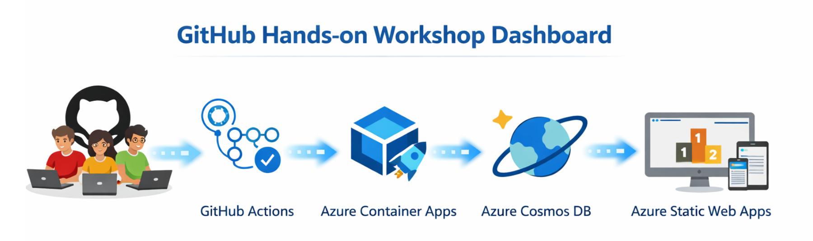

# GitHub Hands-on Workshop Tracker

GitHub Skills 기반 핸즈온 워크숍에서 참가자의 시작, 단계별 진행, 완료 이벤트를 실시간으로 수집하고, 먼저 완료한 순서대로 리더보드를 보여주는 대시보드입니다.



## 배포 주소

- Dashboard: https://github-skills.studydev.com

## 핵심 기능

- 워크숍 랜딩 페이지: 세션 선택 전 워크숍 설명과 주요 기능을 안내하는 소개 화면
- 세션 생성: 교육 회차별로 세션을 만들고 트랙, 시작일, 종료일을 관리
- 세션 수정: 기존 세션의 이름, 트랙, 일정을 수정하고 GitHub Actions 스니펫 재확인
- 실시간 피드: start, step, end 이벤트를 SSE로 즉시 반영 (사용자 아바타 포함)
- 포디움 리더보드: 완료 시각 기준 상위 10명을 피라미드 형태로 표시
- 진행 현황: 시작 인원, 완료 인원, 완료율을 세션 단위로 집계
- 참가자 테이블: 동적 컬럼으로 시작 → 단계별 진행 → 완료 상태를 한눈에 파악
- GitHub 아바타: GitHub user_id 기반 프로필 이미지를 리더보드, 참가자 목록, 실시간 피드에 표시
- Repo URL 추적: GitHub Actions 호출 시 사용자의 Repo URL을 자동 저장 및 참가자 목록에 표시
- 참여 이력 검색: GitHub ID 또는 Organization 이름으로 검색하여 요약/상세 이력 확인
- Zero Config 학생 경험: 학생은 fork와 과제 완료만 수행하면 됨

## 프로젝트 구조

```
├── backend/           # Node.js/Express API 서버
│   ├── db/            # Cosmos DB 초기화
│   ├── routes/        # API 라우트 (events, sessions, leaderboard, users, stream)
│   └── Dockerfile
├── frontend/          # Vanilla HTML/CSS/JS 대시보드
├── infra/             # Azure 인프라 프로비저닝 스크립트
├── docs/              # 아키텍처 문서, 통합 가이드, 기획 문서
├── scripts/           # 테스트 및 데이터 관리 유틸리티 스크립트
├── images/            # README 이미지
└── .github/           # Copilot 지침
```

## 아키텍처

```text
GitHub Actions
  -> Azure Container Apps API
  -> Azure Cosmos DB

Azure Static Web Apps Dashboard
  -> API polling + SSE subscription
```

## 이벤트 모델

이벤트는 POST /api/events 로 수집되며, DB 저장 시 타입이 정규화됩니다.

| 입력 type | 저장 type | 의미 |
| --- | --- | --- |
| started | start | 학생이 실습을 시작함 |
| step | step | 학생이 중간 단계를 통과함 |
| completed | end | 학생이 실습을 끝냄 |

> **주의**: 통계 쿼리 시 반드시 정규화된 값(`start`/`end`)을 사용해야 합니다.

## 빠른 시작

### 1. 세션 생성

대시보드에서 세션 이름, 트랙, 시작일, 종료일을 입력해 세션을 생성합니다.

### 2. GitHub Actions에 시작 이벤트 추가

```yaml
- name: Report Start to Workshop Tracker
  if: success()
  continue-on-error: true
  run: |
    curl -sf -X POST "https://workshop-tracker-api.jollyocean-9c92d5de.koreacentral.azurecontainerapps.io/api/events" \
      -H "Content-Type: application/json" \
      -d '{
        "sessionId": "<SESSION_ID>",
        "type": "started",
        "username": "'$GITHUB_ACTOR'",
        "repo": "'$GITHUB_REPOSITORY'",
        "track": "github-pages",
        "runId": "start-'$GITHUB_RUN_ID'"
      }'
```

### 3. GitHub Actions에 완료 이벤트 추가

```yaml
- name: Report Completion to Workshop Tracker
  if: success()
  continue-on-error: true
  run: |
    curl -sf -X POST "https://workshop-tracker-api.jollyocean-9c92d5de.koreacentral.azurecontainerapps.io/api/events" \
      -H "Content-Type: application/json" \
      -d '{
        "sessionId": "<SESSION_ID>",
        "type": "completed",
        "username": "'$GITHUB_ACTOR'",
        "repo": "'$GITHUB_REPOSITORY'",
        "track": "github-pages",
        "runId": "complete-'$GITHUB_RUN_ID'"
      }'
```

시작과 완료 이벤트는 서로 다른 runId를 사용해야 중복 키 충돌을 피할 수 있습니다.

## API

| Method | Path | 설명 |
| --- | --- | --- |
| GET | /api/health | 헬스 체크 |
| POST | /api/sessions | 세션 생성 |
| GET | /api/sessions | 세션 목록 |
| GET | /api/sessions/:sessionId | 세션 상세 및 통계 |
| PUT | /api/sessions/:sessionId | 세션 수정 |
| POST | /api/events | 시작, 완료 이벤트 수집 |
| GET | /api/users/search?q=... | GitHub ID/Org 기반 참여 이력 검색 |
| GET | /api/sessions/:sessionId/leaderboard | 완료 순위와 참가자 목록 조회 |
| GET | /api/stream?sessionId=... | 세션별 실시간 이벤트 스트림 |

## 로컬 실행

```bash
cd backend
npm install
export COSMOS_ENDPOINT="https://your-cosmos.documents.azure.com:443/"
export COSMOS_KEY="your-key"
npm run dev
```

```bash
cd frontend
python3 -m http.server 8080
```

프론트엔드는 frontend/app.js 의 API_BASE 값을 사용합니다.

## 기술 스택

| 구성 요소 | 기술 |
| --- | --- |
| Backend | Node.js 18+, Express |
| Database | Azure Cosmos DB NoSQL Serverless |
| Backend Hosting | Azure Container Apps |
| Frontend | HTML, CSS, Vanilla JavaScript |
| Frontend Hosting | Azure Static Web Apps |

## 프로젝트 구조

```text
backend/
frontend/
docs/
infra/
PLAN.md
README.md
LICENSE
CODE_OF_CONDUCT.md
```

## 문서

- 전체 계획: PLAN.md
- 워크플로우 연동 가이드: docs/skills-integration-guide.md

## 라이선스

MIT License를 따릅니다.

## 행동 강령

Microsoft Open Source Code of Conduct를 따릅니다.
